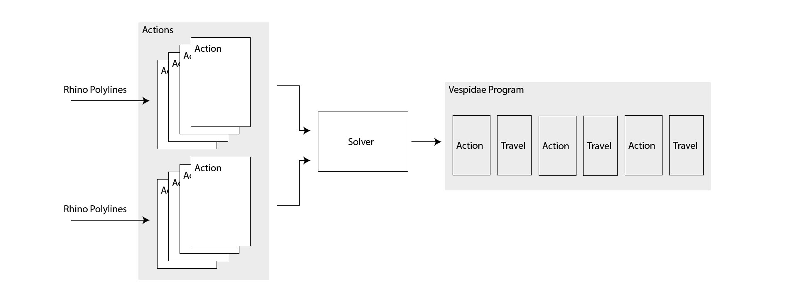

# Vespidae Component Dictionary 

# 1. Curve Tools
*Tools for manipulating geometry in Rhino. This includes clipping tools and soon slicing tools and tools for filling / clearing pockets.*

## Boolean
Performs boolean operations, or *Clipping*, on polygons using the ClipperLib. The operations include intersection, union, difference and xor. See [this](http://www.angusj.com/delphi/clipper/documentation/Docs/Units/ClipperLib/Types/ClipType.htm) for more documentation on the different operations. 

## Offset
Offsets polylines using the Clipper Library offset algorithm. Supports multiple offsets[^Only component] in same operation. Solution will be transformed to the XY plane of the first given polyline

## Infill

Generates infill/hatching inside closed polygons. The algorithm broadly works by generating a set of straight lines over the input polygon, clipping the lines using the input polygon, and finally grouping the clipped lines into sets of connected polygons. 

**->add figure of how infill is generated<-**

Currenty missing direction infill direction as a input . 

*inputs:*
- **crv**: input curve. This must be a closed polygon. 
- **den**: density of infill.  Default value is 1 units. 
- **offset:** infill offset. Default value is .2 units.

*output*
- **crv:** infill polylines represented as a List. 
 
## Sort Curves 

Sorts curves in first Y direction and then X direction. The sorting algorithm currently uses the first point of each polyline when sorting. 

# 2. Actions

_Actions-components converts sets of polylines into Vespidae-actions and tags them with relevant metadata. For example, the ExtrudeAction tags each polyline with an extrusion-parameter that sets the extrusion rate for each move. This metadata is applied by the solvers and visualizers in step 3._

## Action: Extrude

*Extrusion Action.*  

- **crv(curve):** input curves to create Extrude Actions from. 
- **ex(extrusion)** extrusion flowrate multiplier. Extrusion amount is calculated by: `distance x 0.01 x ex`  
- **speed (speed)** - speed of move. Translates to `F_speed_` in gcode. **temp(temperature)** - extruder temperature. Translates to `S_temperature` in gcode. 
- **re (retract):** how much to retract the filament between each operation. See notes for more detail. 

### Notes

Vespidae uses relative extrusion. Its important to "prepare" the filament of the relevant extruders before starting the actual programs. Specifically the filament position should be set to the same value as the retract value used in the Actions. Beeneth is a Extrude Action translated to gcode with *a retract value of 2*. 

	;Action: extrusion
	;extrudeType: shell
	M109 205
	G0 F1000
	G0 E2
	G0 X50 Y110 Z0 E0
	G0 X70 Y110 Z0 E0.2
	G0 X70 Y130 Z0 E0.2
	G0 X50 Y130 Z0 E0.2
	G0 X50 Y110 Z0 E0.2
	G0 E-2
	

## Action: Generic Move
*General purpose movement actions. Good starting point to get familiar withe Vespidae.* 

*inputs:*
- **crv (curve):** input curves to create Move Actions from. 
- **s(speed)**  - speed of move. Translates to `F_speed_` in gcode.   
- **to (tool_id)**  - tool number to execute move with. Translates to `T_toolId_` 
- **gInj (gcodeInjection)** - injects gcode prior to the move. The gcode is added when the action is translated to gcode in step 3.

*outputs:*
- **vobj (vespidae actions):** Input

## Sort Actions 

*Sorts action according to input criteria. So far this includes sorting by x-y and z-directions + by tool number*

*input:*

- **actions** - actions to be sorted. 
- **sort (sort type)** - Sorting options: 0: x-direction, 1: y-direction, 2: z-direction. 
-  **flip**- flips the sorted list.| 

*output:*

- **vobj (Vespidae Actions):** sorted list of Actions. 

# 3. Solve
Solvers are used to compute and derive programs (sequence of actions) from sets of Actions. Specifically the solvers will loop through a sequence of Actions and generate Travel-Actions between each Actions. 

Solvers are also used when converting Actions into gcode.

## Solver: Generic 
Takes lists of actions and transforms them into a list of executable Actions, adding travel moves between each action. The output sequence of Actions is ordered in the same way as they were inputted. 

*inputs:*
- **Vobj (Vespidae Actions)** - Input actions to the solver. 
-  **rh (retract height)** - Retract height between the moves. 
-  **ts (travel speed)** - Travel speed between moves. 
-  **pr (partial retract)** - Enables partial retract between Actions where possible[^the algorithm checks if the next Actions z-height is the same as the current Actions z-height. If yes, it will do a partial retract currently predefined to .2 mm.].

*outputs:*
- **Vobj (Vespidae Actions)** - new list of actions that includes Travel-Actions between each original Action. 

## Solver: Additive

*Specific solver for additive operations. Takes Extrude-actions and sorts them in ascending order based on z-height.*

*inputs:*
- Vobj (Vespidae Actions) - input actions to solver. 
- rh (retract height) - 

*outputs*

### Notes
Current sorting algorith. 

1. Filter Extrude Actions into list
2. Sort Extrude Actions into Dictionary with layerheight as Key. 
3. 

## Solver Gcode
*Takes lists of actions and converts all actions into a single gcode file.*    **Vobj (Vespidae Actions)** - Input actions to the solver.   **h (header)** - inject header gcode.   **f (footer)** - inject footer gcode.|
| ExposePaths | *Visualizes Vespidae Actions in the Rhino Workspace.*   |

# 4. Communicate

|component name|description|
|:--|:--|
## UploadGcode 
*Uploads gcode directly to a Duet controller. Requires a network connection to the duet and that the duet is running [DWC](https://docs.duet3d.com/en/User_manual/Reference/Duet_Web_Control_Manual)*.\ **Do not use a toggle on sendGcode. This will send https requests in an endless loop.:**
