# Vespidae Develop Log

## TODO BOARD

- fix visualization arrows. Especially on smaller travel distances. See entry 0803_2022.
- Add gcode injection to more action components
- Make translation routines smarter (i.e check previous generated gcode for unecessary duplicates).

# Prior log lost in time

Today is all about simple toolpaths and visualization. I need scripts that takes curves as input and translates this into usable machine code. Simultaneously it needs to visualize the machine movement (retract moves, travel moves, etc). I'm not sure if these should be separated or how the data should be formmated, but I figure this will become clear if I work with the data for a while. Here goes.

**first challenge - sort curves**

I need to sort the input curves. I have to create my own specialized sorting function to do this. I dont fully understand this in C#, so I should return to this point and refine in near future. I'm using the LINQ library with a custom sorting function to do this. This looks like this:

    A = polylines.OrderBy(c => c.ElementAt(0).Y).ToList();

I will have to revisit this once I'm doing toolpaths layer-vise.

**adding travel-moves**

**NOTE:** A nice feature would be the ability to separate _move-types_ - e.g operation moves, travel-moves, etc. I'm thinking that this will require a custom class à la this:

    public class Work{
        public Polyline line;
        public string Type;
    }

I think the proper way of doing this will be to create some custom components in Grasshopper in Visual Studio. I'll return to this if needed. For now I think I can handle this by dispatching the output list and assign different colors to the different moves.

**Toolpaths on 3D surfaces**

Simple exercise. Use Grasshopper's Contour component to "slice" 3D surface. Feed the resulting contours to Vespidae's Gcode generator.

# Vinh Battery Printing

Ok so we are printing batteries. This is quite a unique workflow and will be a good showcase for dynamic CAM tools. There are lots of challenges that needs to be addressed. I think I finally need to get a proper-ish slicer up and running in Grasshopper. I'm thinking clipper makes sense here to generate infill toolpaths. I also need a way to test this in real world. For this I will use my trusty Ultimaker as it has two extruders (this compliment nicely with Vinh and his tool-changing Jubilee.

As I understand it Vinh wants to print the base geometry of the battery (a box-geometry full of holes) and park the nozzle over each whole and fill it with plastic using the extruder. The geometry looks like this.

Note to self: investigate how objects can be tagged with metadata using _setUserText_ in Rhino.

# 1310_2022

Starting (b)logging a bit late in the game here but I spent some time getting comfortable with the whole Visual Studio experience again. I've had a hard time setting everything up to run and compile properly, but I'm at a better place now. A highlight from this is how to create solutions that consists of multiple projects in one solution (think one project that holds all the Grasshopper components combined with projects that holds all the supporting code and libraries, for example the logic for Clipper). Following includes a short recipe for setting things up. I'm linking documentation for osx, but equivalent documentation exists for windows on McNeels developer sites. Here goes:

## **Guide for setting things up in Visual Studio**

## _Install McNeel tools in Visual Studio_

First of all install the template tools from McNeel as documented [here](https://developer.rhino3d.com/guides/rhinocommon/installing-tools-mac/).

## _Create Solution_

Follow this guide to create first Grasshopper (or Rhino) component and to understand how they should be set up.

## _Creating Custom Libraries / Projects_

To create class libraries for supporting code right click solution and add new project _(Add->New Project)_. In the following dialog select Library _(.NET->Library)_. After library folder has been generated and added to the solution right click top library folder and select options. Check that build settings are set to Library _(Build->General->Compile Target_.

Now comes the weird part. If you want to include Rhino or Grasshopper namespaces, which you probably do in most cases, you have to go through a couple of extra steps to ensure that it compiles as a library. I'm not sure if this is the proper way to do things, but this is how I did it.

1. First, I changed the target framework of the project to match that of the Rhino/Grasshopper-template generated project. In my case this was .NET Framework 4.8. (Build->General->Target Framework).
2. I then use the NuGet package manager to add Rhino namespace to the project. Right click project folder->Manage NuGet Packages. I then search and add Grasshopper to the project. 3. This changes the build settings and adds a new tab called Rhino. Go to this tab (right click project/Options/Build/Rhino). Then set the Plugin Type to Library. 4. Thats it. Library should be ready for use. Final thing to do is to add a reference to this project from the main Project (again, the one that Rhino/Grasshopper-template generated for you). Right click Rhino/Grasshopper-project/Add Reference. Your new project should be under the Projects-tab. Add it. 5. Build everything and hopefully you will be ok!

## Back to logging

This now includes Clipper. Look [here](http://angusj.com/delphi/clipper.php) for examples and documentation.

# 1701_2022

Started updating the offset component to prepare it for slicing. As of now it only offsets a curve once, but I think it is more useful to enable it to offset a curve multiple times based on a given input number. I added the structure to do this component wise, but It's missing the logic to actually compute this. I'll wrap this up next session.

Today I'm also implementing tools for converting polylines into gcode. Initially I'm doing this bruteforce and separating the "toolpahts" into two separate structures; one with raw gcode and one with polylines that represents the travel moves between each individual operation. I'm thinking that I really should make a better data structure here, where both gcode and polylines are linked in a single data structure / class. A cool thing this could be used for is to visualize the gcode commands in context of the toolpaths they represents in Rhino. I'm returning to this point in the future when I know more about what I'm after. For now, brute force is the way.

I've also added a separate sorting component to the GcodeTool-shelf. Right now it only sorts in Y-direction but it should include some sort options (x,y,z, or combination). I'm also thinking that the Gcode generator should include a sort option.

# 1801_2022

Working on adding infill algorithms to the slicer component. I'm starting out with low complexity for infill patterns. My strategy is to use the bounding box of a Brep, rotate it 45 degrees in regards to the brep to be sliced and use the edges to compute infill lines. I did a short test with Cura and it seems they are using the same strategy.

Puh(!) I have to return to this. After some prototyping I've decided to initially create infill lines in x direction. This is a point I can totally return to, but I'm not so sure how important it really is. Method is extract bounding box of brep, find the min and max points of the bounding box and use these bounds to generate lines with given interval through a for-loop. Here is what it looks like:

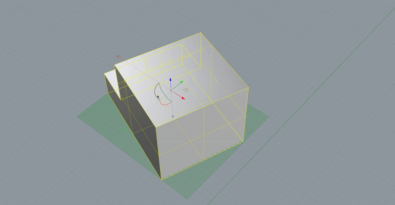

Next thing to do is to find the intersection between the contour of the Brep and the infill pattern and convert this into a toolpath. I scripted a prototype of this in Grasshopper for a single layer. First I extract the contour of the Brep at layer height 0. I then use clipper to compute the intersection between the contour and the infill lines. This gives me a list of polylines that look like this:

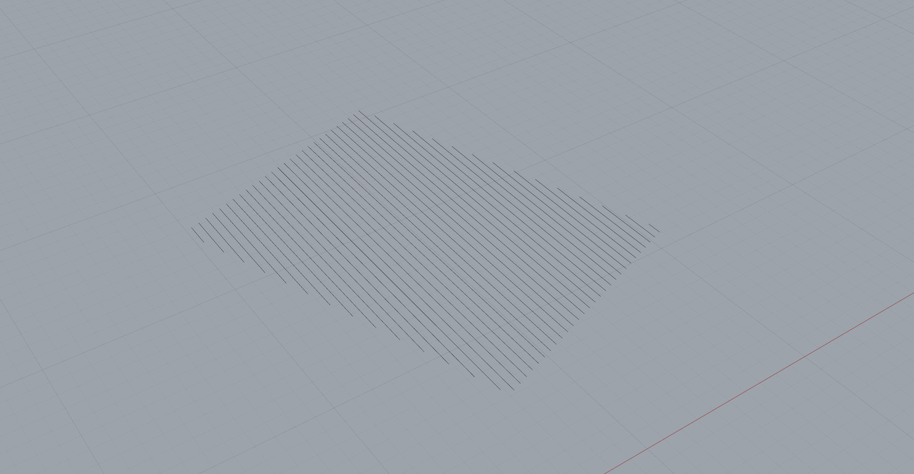

For toolpaths I first sort every polyline in x-direction (I totally need to return to this point and create some kind of vector-based sorting but bare with me). I then flip every second curve (to make the path go "front-and-back"). Finally I iterate over all the points in the list of polylines and connect them. I will need tons of more logic here. This setup will fail if the direction of the infill is too angled in regards to x (because sorting fails). Returning soon. Result looks like this:

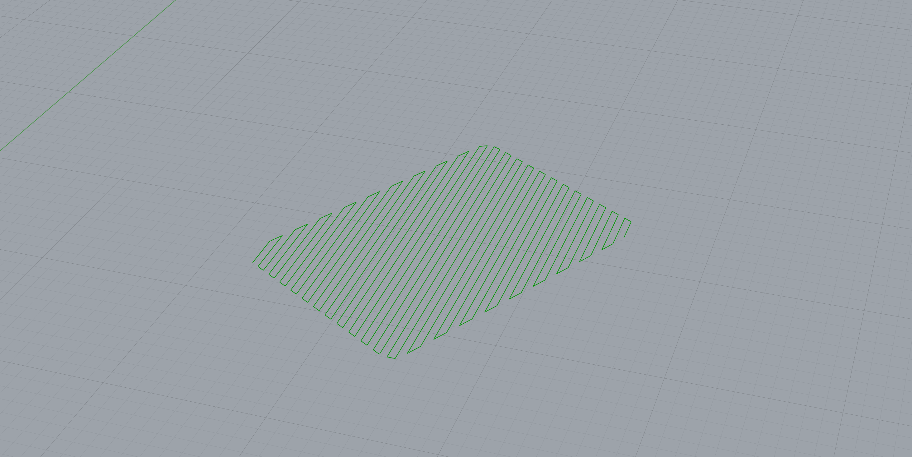

I think I'm ready to put this into my code. First thing to do is to clean up my Clipper implementation. I'm trying to create a one-function-serves-them-all function that can handle any clip type (intersection, boolean, etc). I might need a more specialized function to handle slicing when my contour consists of more then just an outer contour (think pockets in the Brep), but I will return to this. Right now my "boolean" function only does just this, a boolean operation. I'm changing this to giving the intersection type as argument and running this through a switch-case. The function also only return a single polyline. Changing this to return as many polylines as Clipper computes.

Another problem! I'm using wrong clipper. NuGet only provides Clipper 6.4.0(?). Manually adding clipper and changing the version to 6.4.2.

**Things I need to figure out with Clipper:** When I perform a clipping operation, for example difference, the resulting polytree keeps track of outer and inner polygons by nesting them as childs in the polytree. It does this by using a winding number algorithm as documented [here](http://www.angusj.com/delphi/clipper/documentation/Docs/Units/ClipperLib/Types/PolyFillType.htm). Does the same happen with the offset operation?

# 2401-2022

Logging fast today since I'm already behind. Clipper core functionality should now be properly implemented for doing both boolean operations and offsetting. Still, there are some minor things that should be addressed. Most important I need to keep track on height. Clipper computes everything in 2D. When I convert into "clipper-points" I need to keep track of the height and re-apply it when I convert back from clipper to rhino polylines. I'll add this when I need it.

# 2501-2022

I need to think about how I want to structure the data and what a real case user journey looks like. A big goal I'm aiming for is to expose all the steps of a CAM processor and provide simple entry points where we can modify and customize its output and behaviour. For 3D printing for exampel this would entail exposure of the computing of the shells and infills. I'm thinking more and more that I want to create my own data object that contains all the data, and different components that allows step-wise manipulation of this object. I made a quick doodle for reference:

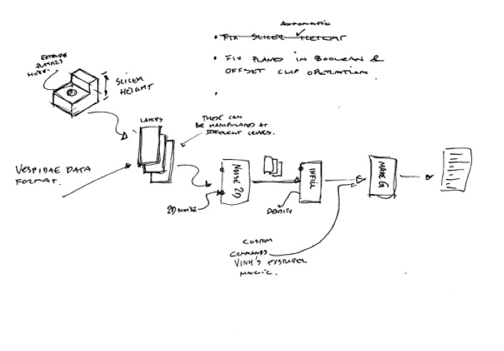

A quick thought on this point: I could go at this from a higher abstraction point. Rather then segmenting the data into _layers_, as in layers in 3d printing, I could segment everything into operations or actions. These would represent any action that I want the machine to perform. I could then create a class that holds all of these actions, and this class would be shared between each Vespidae Component. I would also need a component that translate the class into Rhino-compatible stuff like lines and gcode and so on. I need to think more about this, but since I already created a slicer class that contains all layers I will move forward with a similar structure and see how it feels.

As for slicing I think I want the complete slicer operation to consist of several separate components in Grasshopper; one for contouring the brep, one for creating infill, etc. This both exposes the data that each of these component generates and enables us to manipulate this data as it is flowing through the slicing pipeline.

I've implemented a slicing component and a infill component according to this philosophy. Now we return to the problem of my clipping tool not factoring in height of the polylines its working on. The infill component uses clipping to calculate the intersection between the generated infill lines and the contours of the brep. This all works fine, but the calculated infill lines are all outputted on the same height (z=0). Fixing this is a big todo tomorrow!

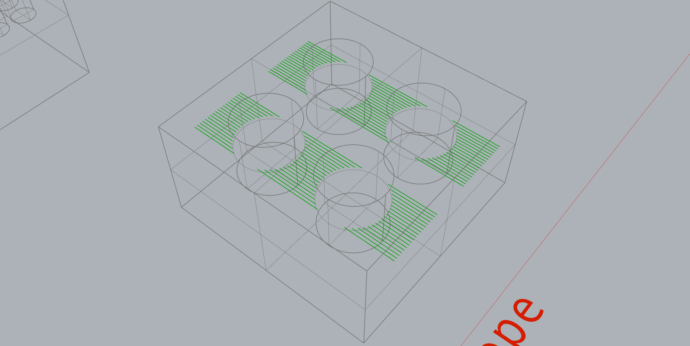

I'm getting close and I'm starting to like the feel of this. Hopefully shooting for a physical test on the ultimaker this week!

# 2701_2022

Spent some time today to try to figure out how to connect clipped infill lines into connected toolpaths. This is a bigger struggle than I imagined it to be and I didn't really arrive at a good solution. A brief overview of my problem:

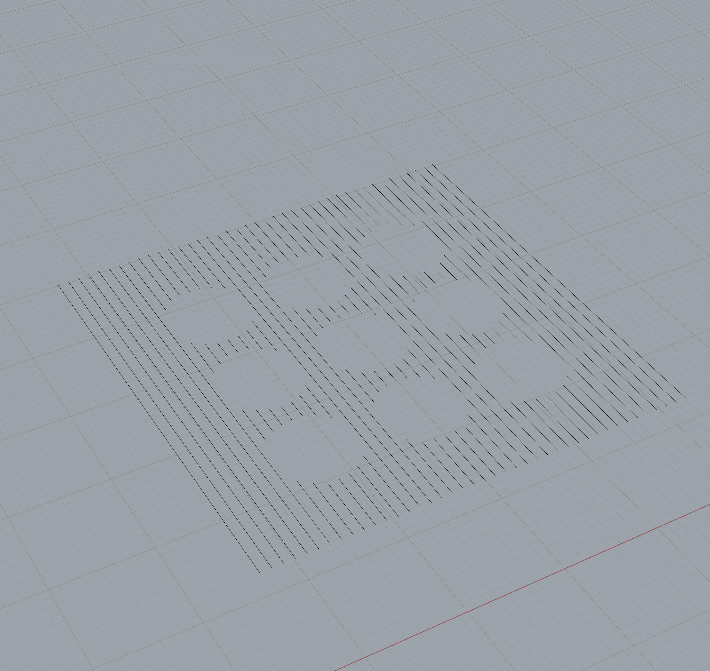

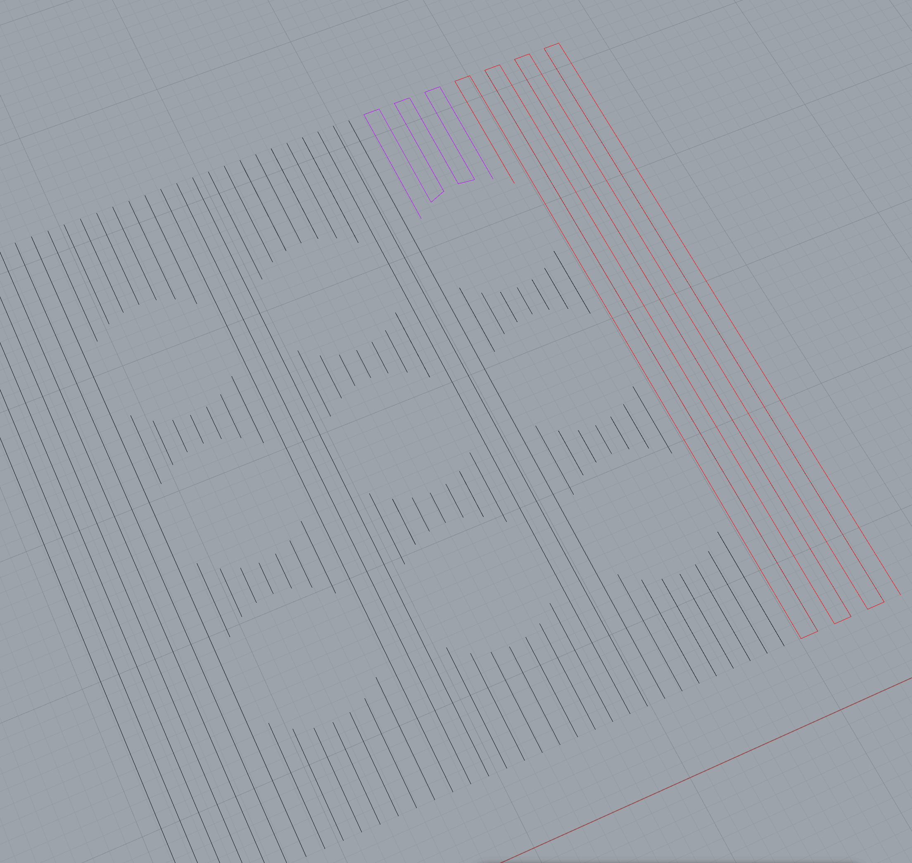

I think there are several ways to go about this, but utlimately this is a np-hard problem and I have to go through some kind of search tree. I tried to develop a couple of different strategies here, namely creating a dictionary of points with connected point in polyline and using this to search and check for intersections. I think this could work but I need to define better logic. This is not critical for my slicer to work, the printing will just be a bit slower since I have to lift the nozzle between each line. I'll return to this point when I'm ready to optimize.

Write about plans for top / bottom shells and infill density.

# 0402_2022

Been bad at logging progress. I've shifted a lot of stuff around this week and I think I'm finally arriving at a structure I feel good about.

**Clipper offset:** I revisited my offset component after a talk with Jens. Jens is missing two features: ability to offset multiple times and better / more logical sorting of inside / outside polygons in context of slicing. This is also something I totally need for slicing. I've modified the Offset-component with a new input that lets us set number of offsets in addition to the offset delta. What would be neat to add on this note is an option that just offsets until it cant offset anymore (think generating infill).

# 0602_2022

~~Extracting extrusion values for z pinning from Cura. By default Cura gcode moves to a corner and extrudes a set amount of plastic to clean the extruder before printing starts (prime blob). The code for this looks like this:~~

The code for prime blob is not included in the gcode as this is done through firmware.

Did first round of "real" testing on Ultimaker and exposed several problems.

- How does a move object extrude? How do I add extrusion to a path? It might make sense to create a class for each move type. If not, I need to add some new parameters and logic.
- How should the machine be set up intitally before all the Vespidae operations are performed? For now I think this can be handled manually using headers.
- Creating moves between operations: Do I need to do this? It is totally necassary for visualization. When should I compute travel moves? Should I wait till all Vespidae operations are generated and then generate? Or should I generate on each operation?

# 0802_2022

Adding extrusion. From Cura:

    G1 X112.282 Y103.215 E25.98213
    G1 X120.852 Y103.215 E26.07617

From this: \
$120.852 - 112.282 = 8.57$\
$26.07617 - 25.98213 = 0.09404$

So per unit this is: $0.09404 / 8.57 = 0.010973$

# 1402_2022

Restructure for toolpathing philosophy. I know call everything **Actions**, and I've implemented this as an abstract class. We can have different Actions like Move, Extrude, Cut, and these actions all inherit from the Base class but can have additional special parameters. The cool thing about this is that I can chain all Actions into one List which makes everything pretty and understandable.

**Missing and todo next time:**

- I need a good way to keep track on extrusion. Either I can reset extrusion value for each action by sending a G92 E, or I need to define a better logic to keep track on this. What I should think about here is if gcode is generated as Actions are created or if gcode is created one time running over all actions (makes more sense?)
- Fix categories
- Modify sorting component to take vector input.
- Start thinking about toolpath texture. Think about how displacement and bump maps are used in texturing.

Finally I need to start about creating some tutorials / documentation for how this can be used and what a user journey might look like.

# 1502_2022

Added proper extrusion like discussed in last entry. Gcode is not computed before all actions are ready chained together. This means I can keep track of extrusion across different sets of Actions. I also cleaned up the categories a bit.

Vinh shared his [project page](https://github.com/invinhtory/GrasshopperPrinting) where he is using Xylinus for creating code a Aerotech machine. Aerotech uses a different flavour of gcode - for example moves are defined as Linear X Y Z instead of G0. How can you adapt your translation components to handle this and what does this interaction look like in Grasshopper?

Apart from that I think I'm good to go to start testing. I've set up a Rhino document with 3 different tests - 1. A simple test that just print some 2D lines, 2. Z-pinning, 3. Spiral-vase which will be first testing ground for texture component.

# 1702_2022

- How can I visualize order of actions?
- Should I offset .2 in z direction or is this a user action?
- Visualization of move in and move out is important

# 2102_2022

**_Mix-G_**:

pattern small gcode programs. For example use points to define center points of gcode and then pattern in direction.

Add converter from gcode to VObj. Gcode visualized as its typed and injected into program.

**z-pinning solver problem**

operation solver does not handle zpinning in a good way. Rethink z-height ifelse in code. Right now it compares first z-height of each path. Should compare last z-height to first z-height as it is iterating. **I added this in code but did not have time to verify / check if it is working.**

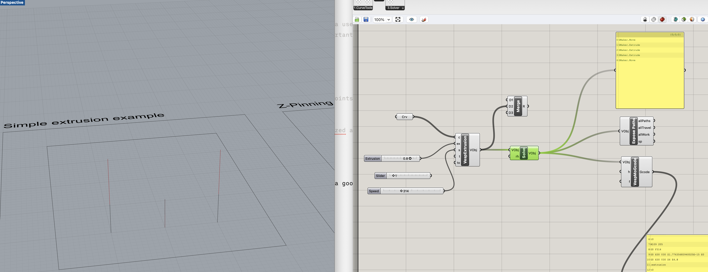

# 2302_2022

I need to think more about patterning. Ideally it should be possible to pattern VespActions. Either this can be done on curve-level, like using the array shelf tools in Grasshopper on the curves before we convert it to VespActions, or I need create my own patterning tools for the actions. I'm thinking that the latter will make more sense but then I also need to think more about how I visualize the Actions. I think my only choice here is to create sort of a _Action-visualizer_ kind of the exposePath-tool that I have now. Note to myself on how this looks:

1. **Bundle up a set of actions** - for example 4 extrudes and one z-pin.
2. **Use pattern tool to pattern the actions**
3. **Send action list to solver** - moves between the actions are added and
   final visualization is shown.
4. **Convert to gcode**

Quick note on this topic: What would an Action bundle look like? Would it ever make sense to bundle together a sequence of Actions. And should this have a _bundle-solver_? Also quick note on solvers in general. I can make different solvers for different objectives. For example one Solver could solve for quick printing, another solver could solve with some type of sorting (or does sorting happen before solving)? How are solvers used in for example Houdini? Or in Kangeroo? When and how could a user customize a solver?

# 2402_2022

Talk with Jens. Jens likes what he sees. Requests & suggestions:

- Keep polytree structure when converting to gcode. Makes sense. User can just flatten if they want.
- Add visualization of entry and exit on toolpaths. Currently cant access coloring from C#, but can make small vectors or shapes that represents arrows.

# 2502_2022

Todays todos. Finish 01_example. Main gist is to show how to pattern VespActions with variations of input data. Found some bugs in offset component - input plane translates wrong after converting back into polylines. This could also be a good point to fix inside/outside filtering.

# 2802_2022

Faster way to debug Rhino C# code? -> [link](https://discourse.mcneel.com/t/howto-run-c-script-in-rhino-using-vs-code/87642)

[Raster algorithm](https://www.mathematik.uni-marburg.de/~thormae/lectures/graphics1/code_v2/RasterPoly/index.html)? This is taken from [here](https://www.mathematik.uni-marburg.de/~thormae/lectures/graphics1/graphics_3_2_eng_web.html#1).

# 0403_2022

Working on visualizing toolpaths in a good way. After discussion with Jens we agree to use mesh arrows to visualize direction. Jens showed me some cool prototypes of how this could also look in above-3-axis-toolpath. For now I'll stay with 3-axis but this could make for some fun future exercises. Here is a gif of how it looks now:

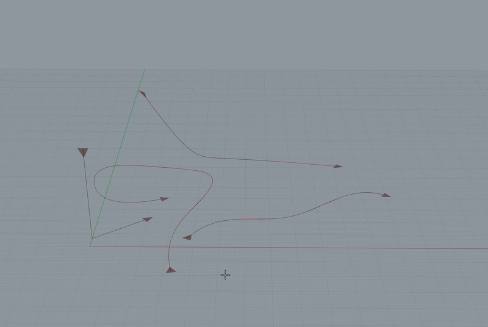

Some quick thoughts about visualizing. Frequency could communicate speed, color could communicate tool or action-type.

# 0503_2022

Did a bunch of tweaks today and I think I'm at the final push before people can actually start using this. I implemented a new genereric Action type called just move. I'm using this action as a part of my initial getting-to-know-vespidae example. Travel moves between actions are now called, well, Travel. I also went back and cleaned the Gmaker library. I implemented a boolean value to select partial retract in the solver. A missing thing in the solver (I think) is to separate lift speed from travelling speed. A lot of machines (including frikk-clank) uses different drivetrains on the z axis then the xy axis. I'm putting this down in **bold todo.**

I integrated the arrow script in the previous entry into the ExposePath component and added a arrowScl parameter that lets us change scale of arrows. Next move here is to use different scale or frequency on the arrows to visualize different action types. I'm also pretty sure that I should be able to tweak the preview colour from C# but that will be a future thing.

All in all this is starting to feel good. I did some dry runs on frikk-clank to get the feel. I think the next thing I'm implementing is a component that uploads (and runs?) the gcode on the duet board. This will also be super useful for my Jubilee friends.

# 0803_2022

Added new component for uploading gcode directly to the Duet from the grasshopper canvas. The compomnent generally picks up the thread from old-vespidae and uses http requests to communicate with the duet. More specifically it sends gcode as a PUT requests. The details of the format are more documented [here](https://github.com/frikkfossdal/frikk-clank/tree/master/duet). Currently I'm just converting Lists with strings into one big string chunk. This might come back to bite me. I think a better and more correct solution is to do [this](https://stackoverflow.com/questions/1131425/send-a-file-via-http-post-with-c-sharp).I'll circle back if it becomes a problem.

The gcode upload should work on any other machine that uses the Duet3 as long as the duet framework is running. **A good way to check that is to check if the web app is up and running.** I've added the file upload to [**Example_00**](https://github.com/frikkfossdal/Vespidae/tree/main/examples). On this point I think a next good step would be to add a execute gcode component.

I have also started implementing a component that works asynchronously from the main ui thread using the [AsyncComponent](https://speckle.systems/blog/async-gh/) library. Right now this is only running the default example of calculating primes but I'm thinking I will circle back to this and try to use this to keep track of machine state and doing async communication with the machine in differnet ways.

Next step is to implementvisualizers that takes _Action-type_ into account. I'm thinking that I will use arrow size and period to visulize different operations. I also want to play a bit with the different annotation tools in RhinoCommons and see if I can create anything useful. A cool idea here could be to for example group different operations together and tag them with operation specific meta-data. I think I have to play a bit around with this to get more ideas.

Final note: I have to do something about arrow sizes on really short paths. This is super obvious on the partial retract travel moves. Could it be an idea to check line distance and use this to scale arrow size? Or maybe just drop it if the arrow size ends up being tiny? Also is it better to set the arrow in the middle of each vertical/lift move?

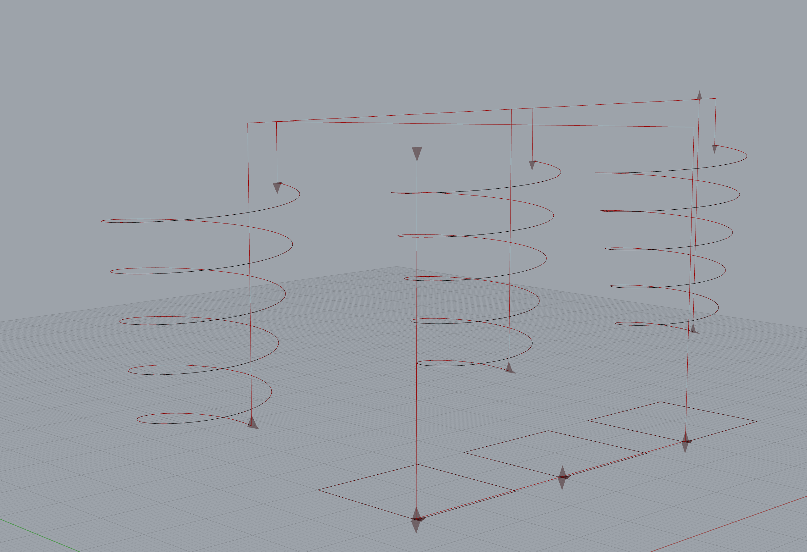

# 0903_2022

Added gcode injection to Move component. I feel good about this. This lets us for example change jerk settings on individual actions. I've added a example_01 to showcase how we can use this to tune machine.

Modified the sendGcodeTask in httpComs with a timeout so it doesnt hold up the ui thread if for example a non valid ip adress is used. Currently set to ten second timeout:

     HttpClient client = new HttpClient();
     client.Timeout = TimeSpan.FromSeconds(10);

**Keep this in mind** on bigger files / longer programs.

I also did some network changes on the test machine. This is documented in frikk-clank documentation.

# 2303_2022

Added a new sorting component that lets us choose different types of sorting (x,y,z or tool) and direction/reverse. There might be more interesting things to sort by but we can add these as we go along. The sort functions are all defined as static function in Gmaker.

There still is an error in the solver / translation routines in Actions. It adds the last point of the previous operation to the travel. This made sense when I didnt have tool changing but is wrong now. This is highest priority on fix list.

# 2503_2022

Back working on the solver today. There are a couple of inconsistencies in the gcode that I want to handle. I also want to improve the visualization by trying to differentiate different Action types by using different symbols.

First the solver. There is a lot of checking when I'm generating travel moves between operations and this makes the code look really messy and hard to cope with. I'm wondering if I can structure it in a better way. All of these moves are just conditions for partial or full retract between two actions. For example:

    if(curAct.z == prevAct.z) //do travel with partial retract
    else //full retract

or

    if(curAct.XY == prevAct.XY) //no retract just go to next point

I can just do that to keep things simpler maybe. Check if we need full retract or not. In professional CAM there are parameters like _stay down level percentage_. Is that what I'm making here? Did a couple of test runs on the clank and the output code feels cleaner now. Onwards to visualization!

The VisualizePathsComponent has been errorous for some time now. I'm suspecting somethings wrong in the way its reading Action objects. Ok I'm stuck here. I tried fiddling with the SolveInstance funciton of the visualizaer but no luck. I'll return with fresh eyes.

# 0704_2022

First round of feedback from Vinh. The Extrude Component totally needs some love as he points out.

**Preheating of tools**\
For now I'll keep preheating in headers. A thought on this point could be to preheat for next Action through code injection on previous Action.

**Absolute vs relative extrusion**\
I'm **changing Vespidae from absolute to relative** extrusion. I should have put more thought into this. I think my initial train of though was that absolute made it easier to keep track of filament use but I realize that this is not really a problem in relative. Relative should also make it a lot easier to customize extrusion amount on each indevidual Action. [This](https://www.sublimelayers.com/2017/10/to-extruder-relative-or-not-to-extrude.html) article was useful to get an overview on the matter.

- I've changed the translation methods to output relative E-values.
- Added `M83` command to tranlation method on Extrusion-Action. I want to change this to an initialization routine on Solver level but this will do for now.

**Retract after extrusion**\
This is a bit tricky. My thinking is that I need to do an intial prep of the extruder before I go through the Actions. This is needs to be handled on Solver level. ..Or maybe not. Initial prep of extruders can be handled through the headers. This is basically what Vinh is already doing. I only need to retract filament after each Action by a specific Value and then move it back into position before I execute next move. Should this happen in Travel Actions or Extrude Actions? And should it be a controllable parameter? It seems important. **Come back to this point.**

**Other things**\

- Added gcode injection on Extrusion component.
- I need to have a discussion with myself about _what I should define and what should be left for a user to define_. Ideally a lot of the operation logic around Actions should be defined by the user. Not only the path the tool is moving by but also the different properties of the path. I think these are things that I will figure out as me and Vinh are going along.

# 0804_2022

Problems you need to deal with:

- goes to retract height first travel move. Not critical but looks dumb.
- retract filament command linked with partial retract
- sorting needs some kind of grouping component. It should be possible to sort groups. Think about this.
- mark start of Vespidae gcode
- remove first E
- ONLY(!) perform T commands (toolchange) when necassary. This is a Solver problem.
- I need some mechanism for sorting by tool in relation to z-height. ..or is this a task for user? Can I handle this by grouping?

**Why are you using _Solvers_?** Main train of thought here is that the solvers makes it easy for me to adapt how programs are created based on type of workflow/operations. Essentially I can let people stack up, group and order all the actions that they want to perform and then I can take all those actions and convert them into programs using Solvers (..and in the end gcode). If there is some weird /special requirements I can adapt a special solver to deal with this. On that note I think that the killer application here would be if I could make it easy for people to define their own solvers in Grasshopper. I'll keep this in the back of my mind as I keep implementing different solvers.

Another thing I should think more carefully about is how the interaction of sequencing actions should be. I think that that is one of the most important feature of Vespidae really. How Actions are executed and in what order needs to be intuitive to manipulate and easy to understand. I think its time for Rhinos Text Dot.

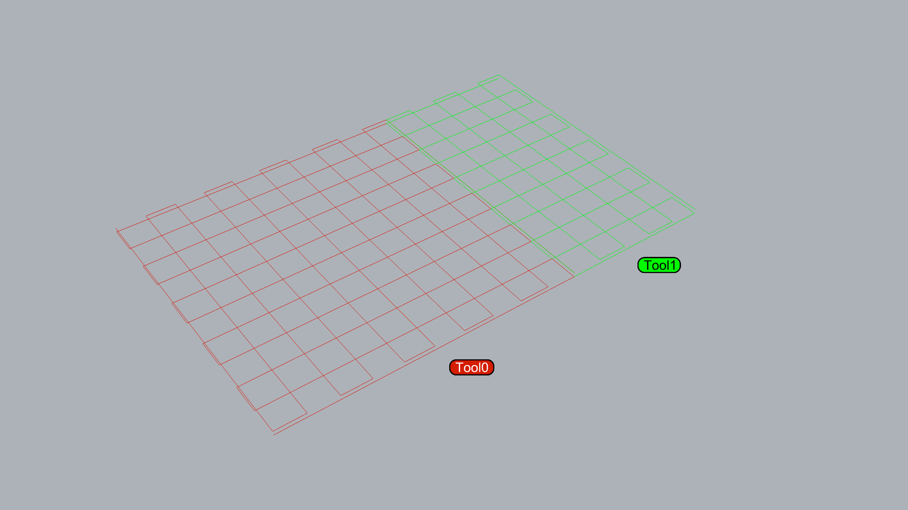

Extrusion operations requires a special Solver that keeps track on layer heights vs tools. It should frist sort out all layers and then sort and group all actions that uses the same tool. I'm guessing this would be the same with milling. Or I'm I thinking about this in the wrong way? Should sorting be handled separately in a step before solving? Or should I fasilitate this as a an option? I'm making a document where I experiment with this [here(example_03)](./examples/files/example_03/)

If me and Vinh work in the same Grasshopper documenent, could that be a good way to check if we are using the same version of the Vespidae components?

I think I need to make a better distinction between representing Actions as polylines in Rhino and representing Actions as gcode. As its defined now the gcode converter blindly parses through each Actions path and converts its points into gcode. The gcode-solver should have more logic that keeps track of whats what and avoids unnecessary gcode. I'm putting this as a big todo next week.

# 1204_2022

- ~~Check first move after toolchange.~~
- think more about separating paths from gcode.
- relative retract heigth. Right now its absolute and thats dangerous!
- implement additive solver

Some things you should articulate better with visualization:

- clearly show start point of a program.
- find a better way to mark toolchange.

Write about insights you get by coding all of this stuff.

# 2204_2022

New notes from Vinh. Here are the main todos:

- Give more control of the retraction parameters on the ExtrudeActions.
- We want to add priming. We think that priming really should be dealt with on the Solver level, that it also could be nice to have it as an Action.
- We need a new solver for doing additive stuff. This will be number one priority. The Solver should expose different parameters for how Actions are sorted.

On that final note, I'm still not sure when and how sorting should happen. My initial thinking was that sorting should be completely exposed and up to the user to configure, **before** the solver runs its magic. However as it is configured now, this kind of forces us to choose one type of sorting (think what happens if your first sort in x and then sort again by for example tool number). I'll try to add several sorting options (and options for chaining sorting) in the new additive solver. I totally want to come back in future and add more complex sortin schemes to the stand-alone sorting component.

I also started looking into better visualization. This is really a mess in Grasshopper but its supposed to improve in Grasshopper 2. I need to override the visual preview that the component generates by default. Look at [this](https://discourse.mcneel.com/t/can-drawviewportwires-draw-gh-objects/77494) thread. David Rutten provides a useful example.
\

# 2704_2022

Today working on new solver component for additive operations. I'm also trying to rework some of the visualization that goes along with this. 

First solver. I think I want to take all the actions, separate them into separate *layer-objects*, sort actions on each layer, then output everything as raw actions again. The way actions are designed right now they dont really have a layer height attribute. The reasoning here was that the Actions were designed to be paths that are non-planar. I'll ignore this for now and just use the first point on a actions path as reference. 

This is neat. I'm using c# dictionary to sort actions onto layers: 

        foreach (var action in actions) { 
                double index = action.path.First.Z;
                if (layerLookup.ContainsKey(index))
                {
                    layerLookup[index].Add(action);
                }
                else
                {
                    layerLookup.Add(index, new List<Action> { action });
                }
            }

From this we can look through each layer and sort the actions based on a user defined criteria. So for example: 

      foreach (var layer in layerLookup) {
                layer.Value.OrderBy(action => action.path.First.X).ToList(); 
            }

Neat! Final step is just to flatten the structure and run the list of actions through the old solver. 

On that note I want to do some improvements on the how I generate the travel moves when I make a program. Having actions sorted in lists based on layers enables me to simplify a couple of things. For example I can use partial retracts between the actions in each list. I think actually I'll just write a new "program generator" in the additive solver and implement changes on the old solver when I know more about how this looks. 

Again I think I need a higher level representation of programs. Its just so nice having things organized in like this case layers. I need to sketch this on paper. I'm not sure what the translation routines would look like. 

~~**NOTE:** The offset component doesnt work when multiple curves are inputed. Fix this.~~ **fixed**.

Ok. I think the new solver is working. I'll try to do some thorough testing of it tomorrow. 

I think this is the first time I'm really experiencing how powerful this workflow can be. I think Jens has been trying to show me this all along but I didnt really get it.

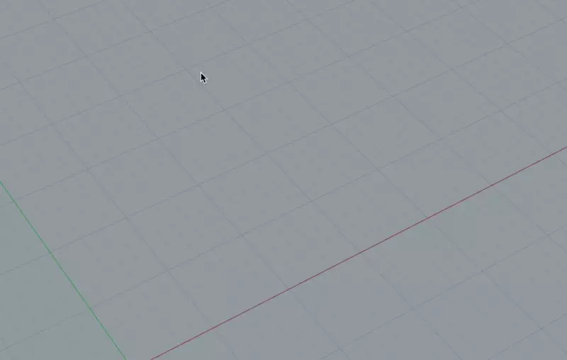

So things are shaping up. Tomorrows todos: 

- sketch out what a grouping / program class would look like 
- work on visualization. On this note write an email to jasper and ask him about toolpath css. 
- See if you could make a simple closed polygon infill generator. 

# 2804_2022 - infill 

Some notes on making an infill generator:
	- something happens every time the number of intersections changes.
	- think more about the discussion in [this thread](https://stackoverflow.com/questions/15668149/polygon-infill-algorithm). 
	- [Evil mad scientist](https://wiki.evilmadscientist.com/Creating_filled_regions) has really good notes about hatching.
	- [this](https://github.com/Tannz0rz/Mandoline) looks promising.

Also some quick thoughts about organization. I think that all curve manipulation functions can live in what is now called ClipperTools. I'll see about renaming this sometime in the future. For now I'm not going to focus more about creating a complete slicing scheme. For Vinhs case I think its more interesting to create the individual building blocks of a slicer and offer them as components.

Ok so I redid the infill component and I think its really neat. Missing: 

- Control direction of infill (with a vector?). 
- Prettify the code. I dont like that I need to redeclare the polygons as lists to be able to use the static clipper functions. 
- I need to enable polygon clipping on the indside of infill polygons. Not sure what this interaction looks like. 
- Connect the polygons! 

It might make sense to have infill as a separate action. I'm putting this down as a todo note. 

Explore how the infill component works together with the offset component. Infill should really be based on the inner of the offset polygons. Not a big problem but annoying. Not really sure how this could be fixed though without having metadata. 

Ok finally have sort of working grouping of infill. I'll document tomorrow. 

# 2904_2022

Quick note to self about the new infill function. I think its better if I change the dictionaries value type to List of polylines instead of *one* polyline that I just keep adding lines to. Or maybe not. I nearly worked it our with the current hack. Seems like this is dependent on the shape of the geometry. It needs some more work but I'm close. Here are some unsolved todos: 

- Infill only accepts single polygon? Investigate. 
- Fix flipping of polylines when linking clipped lines together. I think the solution lies in changing the data type as described above.
- Fix additive solver. Its missing travel moves generation. Keep in mind the opportunity you have now that everything is organized onto neat layers. 
- Test the gcode!

# 0204_2022

Ok infill is finally working. Also added working offset. **Infill is missing a way to control infill angle**.

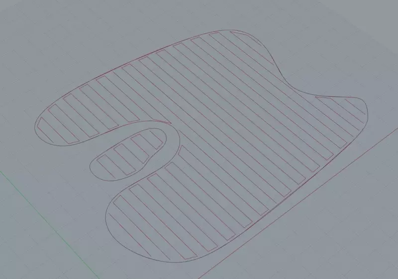

I did a quick test on clank. There still is something weird going on in my gcode. Its on the first move if its doing toolchange and the machine doest have toolchange. Add sensitity for this. 

I need a way to separate different types of Extrusion-actions I think. I want the additive solver to be able to for example sort actions that are shells from actions that are infill. Ok I added a new enumeration to the VespidaeTool namespace. The Extrude Action class tags each action with a ExtudeType enumeration like `infill` or `shell`. 

Again grouping seems to be a reasonable thing to have in this setup. This will be first thing to investigate once im out of implementation hell. 

**TODOS:**

- Option to ignore tool commands. Especially on the generic/move action component. 
- Add keep original to offset curve component. 
- Add fixed min value on infill component. If resolution is set to too low Rhino goes bonkers! 
- direction based infill.
- Fixed that darn additive solver. 

Todays victory is the new infill component and putting it to use in a battery-ish-scenario. I think I understand more about what directions I should pull this in. More tomorrow. 

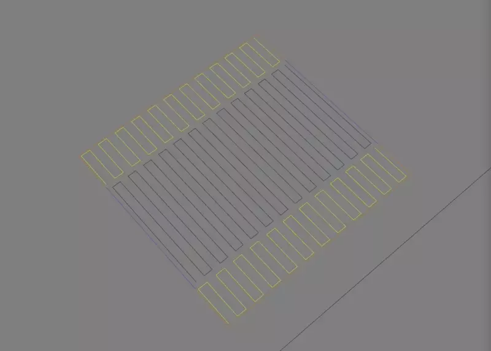

