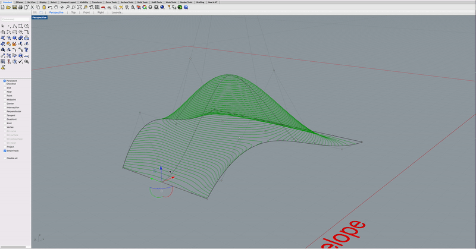

# Vespidae Develop Log

## Prior log lost in time 

Today is all about simple toolpaths and visualization. I need scripts that takes curves as input and translates this into usable machine code. Simultaneously it needs to visualize the machine movement (retract moves, travel moves, etc). I'm not sure if these should be separated or how the data should be formmated, but I figure this will become clear if I work with the data for a while. Here goes. 

**first challenge - sort curves**

I need to sort the input curves. I have to create my own specialized sorting function to do this.  I dont fully understand this in C#, so I should return to this point and refine in near future. I'm using the LINQ  library with a custom sorting function to do this. This looks like this: 

	A = polylines.OrderBy(c => c.ElementAt(0).Y).ToList();
	

I will have to revisit this once I'm doing toolpaths layer-vise.

**adding travel-moves**

**NOTE:** A nice feature would be the ability to separate *move-types* - e.g operation moves, travel-moves, etc. I'm thinking that this will require a custom class à la this: 

	public class Work{
	    public Polyline line;
	    public string Type;
	}

I think the proper way of doing this will be to create some custom components in Grasshopper in Visual Studio. I'll return to this if needed. For now I think I can handle this by dispatching the output list and assign different colors to the different moves. 

**Toolpaths on 3D surfaces**

Simple exercise. Use Grasshopper's Contour component to "slice" 3D surface. Feed the resulting contours to Vespidae's Gcode generator. 

## Vinh Battery Printing

Ok so we are printing batteries. This is quite a unique workflow and will be a good showcase for dynamic CAM tools. There is lots of challenges that needs to be addressed. I think I finally need to get a proper-ish slicer up and running in Grasshopper. I'm thinking clipper makes sense here to generate infill toolpaths. I also need a way to test this in real world. I'm thinking I will use my good ol' Ultimaker as it has two extruders (this compliment nicely with Vinh and his tool-changing Jubilee. 

As I understand it Vinh wants to print the base geometry of the battery (a box-geometry full of holes) and park the nozzle over each whole and simply fill it with plastic using the extruder. The geometry looks like this. 

Note to self: investigate how objects can be tagged with metadata using *setUserText* in Rhino. 

This now includes Clipper. Look [here](http://angusj.com/delphi/clipper.php) for examples and documentation. 

## 1310_2022

Starting (b)logging a bit late in the game here but I spent some time getting comfortable with the whole Visual Studio experience again. I've had a hard time setting everything up to run and compile properly, but I'm at a better place now. A highlight from this is how to create solutions that consists of multiple projects in one solution (think one project that holds all the Grasshopper components combined with projects that holds all the supporting code and libraries, for example the logic for Clipper). Following includes a short recipe for setting things up. I'm linking documentation for osx, but equivalent documentation exists for windows on McNeels developer sites. Here goes: 

### **Guide for setting things up in Visual Studio**

### *Install McNeel tools in Visual Studio*

First of all install the template tools from McNeel as documented [here](https://developer.rhino3d.com/guides/rhinocommon/installing-tools-mac/).

### *Create Solution*

Follow this guide to create first Grasshopper (or Rhino) component and to understand how they should be set up. 

### *Creating Custom Libraries / Projects*

To create class libraries for supporting code right click solution and add new project *(Add->New Project)*. In the following dialog select Library *(.NET->Library)*. After library folder has been generated and added to the solution right click top library folder and select options. Check that build settings are set to Library *(Build->General->Compile Target*. 

Now comes the weird part. If you want to include Rhino or Grasshopper namespaces, which you probably do in most cases, you have to go through a couple of extra steps to ensure that it compiles as a library. I'm not sure if this is the proper way to do things, but this is how I did it. 

1. First, I changed the target framework of the project to match that of the Rhino/Grasshopper-template generated project. In my case this was .NET Framework 4.8. (Build->General->Target Framework).
2. I then use the NuGet package manager to add Rhino namespace to the project. Right click project folder->Manage NuGet Packages. I then search and add Grasshopper to the project. 
	3. This changes the build settings and adds a new tab called Rhino. Go to this tab (right click project/Options/Build/Rhino). Then set the Plugin Type to Library. 
	4. Thats it. Library should be ready for use. Final thing to do is to add a reference to this project from the main Project (again, the one that Rhino/Grasshopper-template generated for you). Right click Rhino/Grasshopper-project/Add Reference. Your new project should be under the Projects-tab. Add it. 
	5. Build everything and hopefully you will be ok! 

### Back to logging 

## 1701_2022

Started updating the offset component to prepare it for slicing. As of now it only offsets a curve once, but I think it is more useful to enable it to offset a curve multiple times based on a given input number. I added the structure to do this component wise, but It's missing the logic to actually compute this. I'll wrap this up next session. 

Today I'm also implementing tools for converting polylines into gcode. Initially I'm doing this bruteforce and separating the "toolpahts" into two separate structures; one with raw gcode and one with polylines that represents the travel moves between each individual operation. I'm thinking that I really should make a better data structure here, where both gcode and polylines are linked in a single data structure / class. A cool thing this could be used for is to visualize the gcode commands in context of the toolpaths they represents in Rhino. I'm returning to this point in the future when I know more about what I'm after. For now, brute force is the way. 

